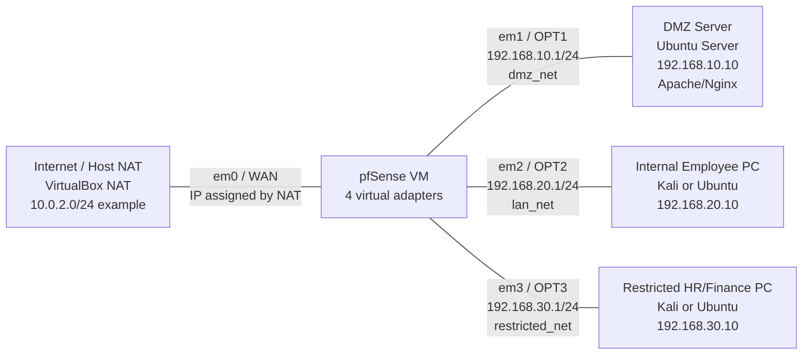

# pfSense VirtualBox Network Topology Lab

## Objective

Build a segmented network in VirtualBox using a pfSense firewall/router VM with four interfaces:

- WAN for Internet access through VirtualBox NAT
- DMZ for a public web server
- Internal LAN for an employee PC
- Restricted network for HR/Finance

The security policy allows only required traffic and relies on pfSense default deny behavior for everything else.

## Project Files

| File | Purpose |
|---|---|
| `README.md` | Main build guide and rule logic |
| `quick-start.md` | Shortest path through the build |
| `topology.html` | Polished topology diagram for screenshots |
| `topology.mmd` | Mermaid topology source |
| `firewall-rules.csv` | Importable/shareable firewall rule table |
| `submission-checklist.md` | Evidence checklist before submitting |
| `linux-vm-commands.md` | Static IP, Apache, SSH, and test commands |
| `pfSense-gui-steps.md` | Exact pfSense web UI configuration steps |
| `validation-plan.md` | Test cases, commands, and expected results |
| `troubleshooting.md` | Fixes for common VirtualBox/pfSense issues |
| `final-report-template.md` | Report template to fill with screenshots |
| `resume-interview-notes.md` | Resume bullet and interview explanation |

## Network Topology



## Interface Addressing

| Zone | pfSense Interface | Subnet | pfSense Gateway IP | VirtualBox Network |
|---|---|---:|---:|---|
| WAN | em0 / WAN | NAT from host, example `10.0.2.0/24` | Assigned by NAT | NAT |
| DMZ | em1 / OPT1 | `192.168.10.0/24` | `192.168.10.1` | Internal Network: `dmz_net` |
| Internal LAN | em2 / OPT2 | `192.168.20.0/24` | `192.168.20.1` | Internal Network: `lan_net` |
| Restricted | em3 / OPT3 | `192.168.30.0/24` | `192.168.30.1` | Internal Network: `restricted_net` |

## Virtual Machines

| VM | Zone | Static IP | Gateway | Purpose |
|---|---|---:|---:|---|
| pfSense | All zones | See interface table | WAN via NAT | Firewall/router |
| Ubuntu Server | DMZ | `192.168.10.10/24` | `192.168.10.1` | Public web server |
| Kali or Ubuntu | Internal LAN | `192.168.20.10/24` | `192.168.20.1` | Employee PC |
| Kali or Ubuntu | Restricted | `192.168.30.10/24` | `192.168.30.1` | HR/Finance PC |

## VirtualBox Adapter Mapping

| pfSense Adapter | VirtualBox Attachment | Network Name | pfSense Interface |
|---|---|---|---|
| Adapter 1 | NAT | Default NAT | em0 / WAN |
| Adapter 2 | Internal Network | `dmz_net` | em1 / OPT1 |
| Adapter 3 | Internal Network | `lan_net` | em2 / OPT2 |
| Adapter 4 | Internal Network | `restricted_net` | em3 / OPT3 |

For each non-pfSense VM, attach one adapter only:

| VM | Adapter Attachment | Network Name |
|---|---|---|
| DMZ Ubuntu Server | Internal Network | `dmz_net` |
| Internal Employee PC | Internal Network | `lan_net` |
| Restricted HR/Finance PC | Internal Network | `restricted_net` |

## Build Order

1. Create the pfSense VM in VirtualBox.
2. Add four network adapters using the adapter mapping above.
3. Install pfSense and assign interfaces:
   - WAN = `em0`
   - DMZ/OPT1 = `em1`
   - Internal/OPT2 = `em2`
   - Restricted/OPT3 = `em3`
4. In pfSense, configure interface IP addresses:
   - DMZ/OPT1: `192.168.10.1/24`
   - Internal/OPT2: `192.168.20.1/24`
   - Restricted/OPT3: `192.168.30.1/24`
5. Create the DMZ Ubuntu Server VM and set static IP `192.168.10.10/24`.
6. Create the Internal PC VM and set static IP `192.168.20.10/24`.
7. Create the Restricted PC VM and set static IP `192.168.30.10/24`.
8. Install Apache on the DMZ server.
9. Add the required pfSense firewall allow rules.
10. Run validation tests and capture screenshots.

For exact pfSense web UI click-by-click instructions, use `pfSense-gui-steps.md`.

## Ubuntu Static IP Example

On Ubuntu Server or Ubuntu Desktop using Netplan, edit the file under `/etc/netplan/`, for example:

```yaml
network:
  version: 2
  renderer: networkd
  ethernets:
    enp0s3:
      dhcp4: no
      addresses:
        - 192.168.10.10/24
      routes:
        - to: default
          via: 192.168.10.1
      nameservers:
        addresses:
          - 8.8.8.8
          - 1.1.1.1
```

Apply the configuration:

```bash
sudo netplan apply
ip a
ip route
```

Change the IP address and gateway for the Internal and Restricted VMs:

| VM | Address | Gateway |
|---|---:|---:|
| DMZ Server | `192.168.10.10/24` | `192.168.10.1` |
| Internal PC | `192.168.20.10/24` | `192.168.20.1` |
| Restricted PC | `192.168.30.10/24` | `192.168.30.1` |

## DMZ Web Server Setup

Run this on the DMZ Ubuntu Server:

```bash
sudo apt update
sudo apt install -y apache2
sudo systemctl enable --now apache2
echo "DMZ Web Server - pfSense Lab" | sudo tee /var/www/html/index.html
curl http://127.0.0.1
```

## pfSense Firewall Rules

pfSense rules are evaluated on the interface where traffic enters pfSense.

| # | Interface to Configure | Source | Destination | Port/Protocol | Action | Purpose |
|---:|---|---|---|---|---|---|
| 1 | WAN | WAN net / any external source | DMZ server `192.168.10.10` | TCP 80, 443 | Allow | Permit public web traffic to DMZ |
| 2 | WAN | WAN net / any external source | Internal / Restricted | Any | Deny | Default deny; no rule required unless documenting/logging |
| 3 | Internal | Internal net | DMZ server `192.168.10.10` | TCP 80, 443 | Allow | Employees can browse DMZ web server |
| 4 | Internal | Internal net | Restricted net | TCP 22 | Allow | Employees can SSH to Restricted |
| 5 | Internal | Internal net | Restricted net | Any other | Deny | Default deny after allow rules |
| 6 | DMZ | DMZ net | Internal net | Any | Deny | Default deny |
| 7 | DMZ | DMZ net | Restricted net | Any | Deny | Default deny |
| 8 | Restricted | Restricted net | WAN | Any | Deny | Default deny |
| 9 | Restricted | Restricted net | Internal net | Any | Deny | Default deny |
| 10 | Restricted | Restricted net | DMZ net | Any | Deny | Default deny |

### Required Rules to Add

Add only these allow rules unless your instructor specifically requires explicit deny rules:

| pfSense Page | Action | Protocol | Source | Destination | Destination Port |
|---|---|---|---|---|---|
| Firewall > Rules > WAN | Pass | TCP | Any | `192.168.10.10` | HTTP `80`, HTTPS `443` |
| Firewall > Rules > Internal | Pass | TCP | Internal net | `192.168.10.10` | HTTP `80`, HTTPS `443` |
| Firewall > Rules > Internal | Pass | TCP | Internal net | Restricted net | SSH `22` |

Rule order matters on each interface. Put specific allow rules above any explicit deny rules. If you rely on default deny, no lower deny rule is required.

If the WAN-to-DMZ rule does not work from outside, configure NAT port forwarding:

1. Go to Firewall > NAT > Port Forward.
2. Add TCP port `80` from WAN address to `192.168.10.10:80`.
3. Add TCP port `443` from WAN address to `192.168.10.10:443`.
4. Let pfSense automatically create associated firewall rules.

In VirtualBox with the pfSense WAN set to NAT, "WAN to DMZ" testing from the host may require VirtualBox NAT port forwarding or a second test VM on a bridged/host-only outside network. The internal segmentation tests still prove the firewall policy even if outside inbound NAT is limited by the lab environment.

## Validation Tests

Run these tests after rules are applied.

### Test 1: Internal to DMZ Web Server Should Work

On the Internal PC:

```bash
curl -I http://192.168.10.10
```

Expected result:

```text
HTTP/1.1 200 OK
```

### Test 2: DMZ to Internal Should Fail

On the DMZ Server:

```bash
ping -c 4 192.168.20.10
```

Expected result: packet loss or timeout.

### Test 3: Restricted to WAN Should Fail

On the Restricted PC:

```bash
ping -c 4 8.8.8.8
curl -I http://example.com
```

Expected result: timeout or unreachable.

### Test 4: Internal to Restricted SSH Should Work

Install and start SSH on the Restricted VM if needed:

```bash
sudo apt update
sudo apt install -y openssh-server
sudo systemctl enable --now ssh
```

From the Internal PC:

```bash
ssh user@192.168.30.10
```

Expected result: SSH login prompt.

## Logging

To show blocked traffic in pfSense logs:

1. Go to Firewall > Rules.
2. Open the relevant deny rule, if you created explicit deny rules.
3. Check Log packets that are handled by this rule.
4. For default deny logs, go to Status > System Logs > Settings and enable logging for default block rules if needed.
5. View logs at Status > System Logs > Firewall.

## Screenshot Checklist

Capture these screenshots for submission:

- VirtualBox pfSense VM showing four adapters.
- pfSense interface assignments showing WAN, DMZ/OPT1, Internal/OPT2, Restricted/OPT3.
- pfSense interface IP configuration pages.
- Firewall rule table for WAN.
- Firewall rule table for Internal.
- Firewall rule table for DMZ and Restricted showing no allow rules, or explicit deny rules if configured.
- Internal PC successfully opening `http://192.168.10.10`.
- DMZ VM failing to ping `192.168.20.10`.
- Restricted VM failing to reach WAN, for example `ping 8.8.8.8`.
- pfSense firewall log showing one successful allowed event.
- pfSense firewall log showing one blocked event.

## Final Result Summary

This design separates public, employee, and restricted systems into different Layer 3 zones. The DMZ web server is reachable on web ports, Internal users can reach the DMZ web server and SSH into Restricted, and all other cross-zone or Restricted-to-WAN traffic remains blocked by pfSense default deny rules.

## Security Concepts Demonstrated

- Network segmentation using separate subnets and firewall interfaces.
- Principle of least privilege: only required services are allowed.
- DMZ isolation: public-facing services cannot initiate access to internal systems.
- Restricted-zone protection: sensitive systems are isolated from general traffic.
- Default deny firewall posture with explicit allow rules.
- Firewall logging and evidence-based validation.
